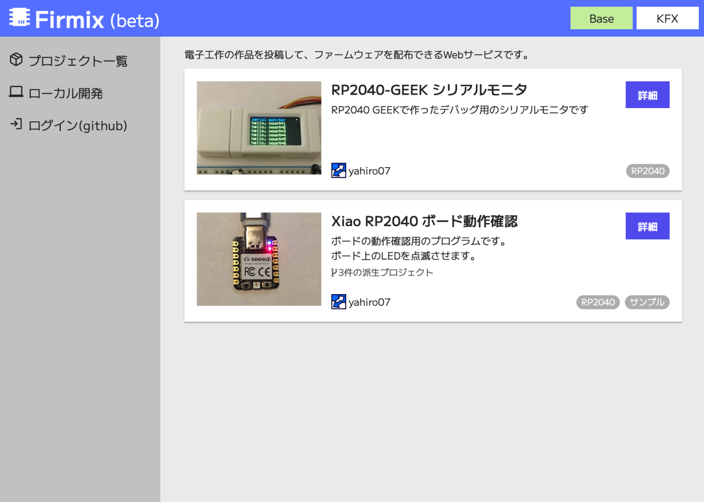
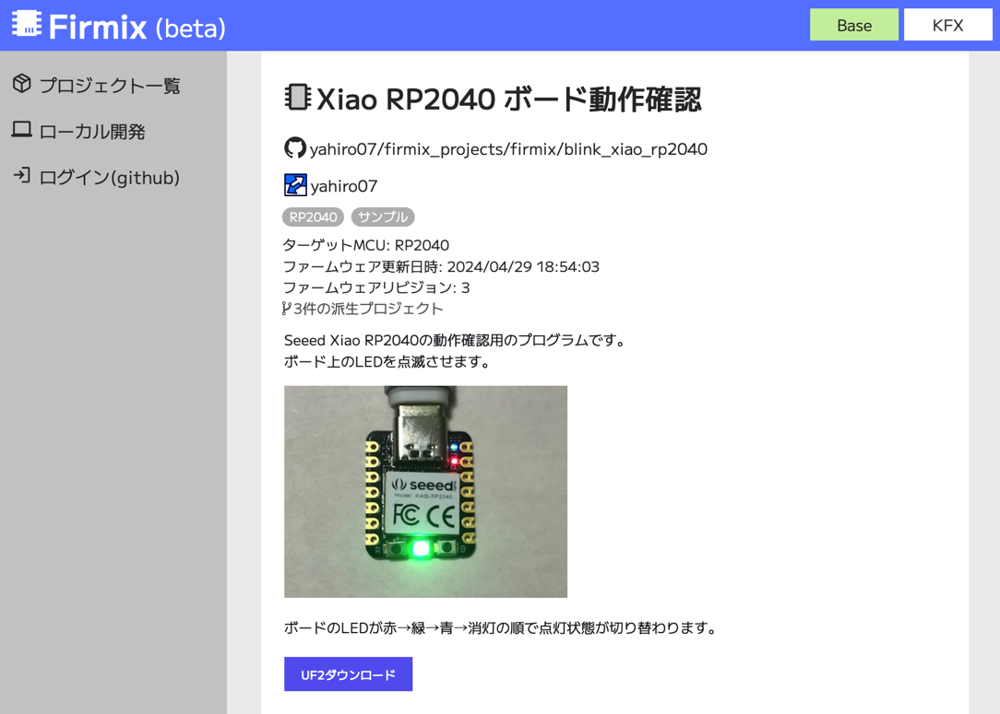
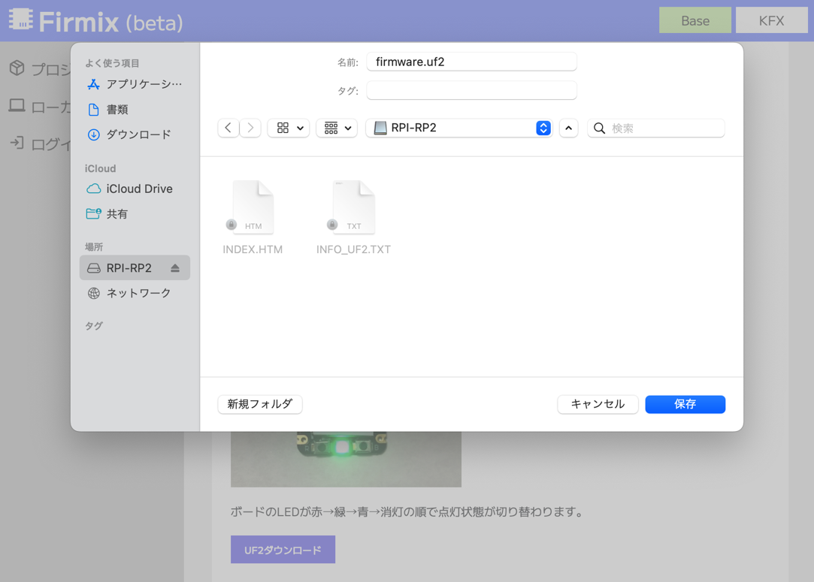

# サイトの使い方

## プロジェクトの閲覧

サイトのトップページでは、公開されているプロジェクトが新しく投稿された順に表示されます。

各プロジェクトカードの「詳細」ボタンをクリックすると、詳細画面が表示されます。

## ファームウェアの書き込み

投稿されているプロジェクトのReadmeを読み、それに合わせてボードやハードウェアを用意します。

ここではSeeed Xiao RP2040に[こちら](https://firmix.nector.me/project/5g8lvrj0g0)の動作確認用のプログラムを書き込みます。

「UF2ダウンロード」ボタンを押すと、UF2ファイルの保存先を選ぶダイアログが表示されます。

マイコンボードをリセットしてブートローダモードにします。RP2040のボードの場合、

- BOOTボタンを押しながらUSBケーブルを接続
- BOOTボタンを押しながらRESETボタンを押す
- RESETボタンを素早く2回押す

などの方法でブートローダモードに遷移するようになっています。手順はボード毎に異なるため、詳細はボードのドキュメントを参照してください。

マイコンのブートローダがOSによって認識されると、マスストレージデバイスのドライブがマウントされます。Windowsの場合は`D:`や`E:`などのドライブ名、MacOSの場合`RPI-RP2`というボリュームが表示されます。

ドライブのルートフォルダを選択してファームウェアを保存します。

ブートローダによる書き込みが完了するとボードがリセットされ、書き込んだプログラムが実行さます。

