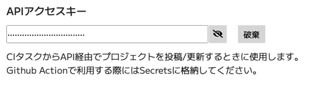

# オートメーション

Firmixには、API経由でプロジェクトを投稿/更新する機能があります。  
プロジェクトのソースコードをGithubで管理している場合に、Github ActionsとAPI経由の投稿機能を組み合わせることで、ソースコードをリポジトリにプッシュ(orマージ)したときに、自動でFirmixに反映することができます。


## アクセスキーの発行

設定画面でAPIのアクセスキーを生成します。



## Workflowの構成

Github ActionsのWorkflowを作成します。

[こちら](https://github.com/yahiro07/firmix_projects/blob/main/.github/workflows/blink_xiao_rp2040.yaml)のファイルを例参考にWorkflowの構成例を解説します。

```yaml
name: Publish blink_xiao_rp2040

on:
  push:
    branches: [main]
    paths:
      - ".github/workflows/blink_xiao_rp2040.yaml"
      - "firmix/blink_xiao_rp2040/**"

defaults:
  run:
    working-directory: firmix/blink_xiao_rp2040

jobs:
  release:
    runs-on: ubuntu-latest

    steps:
      - uses: actions/checkout@v3
      - uses: actions/cache@v3
        with:
          path: |
            ~/.cache/pip
            ~/.platformio/.cache
          key: ${{ runner.os }}-pio
      - uses: actions/setup-python@v4
        with:
          python-version: "3.9"
      - name: Install PlatformIO Core
        run: pip install --upgrade platformio

      - name: Build PlatformIO Project
        run: pio run

      - name: Upload to Firmix
        run: |
          curl --fail-with-body -X POST -H "Authorization: token ${{secrets.FIRMIX_TOKEN}}" \
            -F readme=@./readme.md -F thumbnail=@./thumbnail.png \
            -F project=@./firmix.project.json \
            -F firmware=@./.pio/build/generic/firmware.uf2 \
            https://firmix.nector.me/api/project/upload
```

PythonとPlatformIOを導入して、`pio run`でプロジェクトをビルドした後、`curl`でFirmixのAPIを叩いてコンテンツを送信しています。

## アップロードAPIの詳細

### エンドポイント
POST https://firmix.nector.me/api/project/uploads

### ヘッダ

|キー|値|
|:--|:--|
|Authorization| token Firmixのアクセスキー |
|Content-Type| multipart/form-data |

AuthorizationヘッダでAPIキーを指定します。

### リクエストボディ

`multipart/form-data`で各アセットのファイルを指定します。

|識別子|値|
|:--|:--|
|readme| readme.md |
|thumbnail| thumbnail.(png\|jpg) | 
|project| firmix.project.json | 
|firmware| ファームウェアファイルのパス | 


### curlの書式
```shell
curl -X POST -H "Authorization: token <APIアクセスキー>" \
  -F readme=@<readmeファイルのパス> -F thumbnail=@<サムネイルファイルのパス> \
  -F project=@<メタデータファイルのパス> \
  -F firmware=@<ファームウェアのパス> \
```

### APIの動作

アップロードAPIは対象のプロジェクトをメタデータに含まれるのGUIDによって識別しています。
APIではメタデータからGUIDを抽出し、そのGUIDを持つプロジェクトがすでにDBに存在する場合には、これを更新する動作となります。対象のプロジェクトが存在しない場合は新規投稿として扱います。
GUIDが一致するプロジェクトがあり、そのプロジェクトの所有者が自分以外のユーザーの場合にはエラーになります。