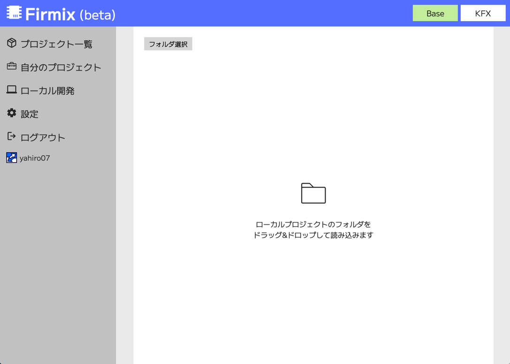
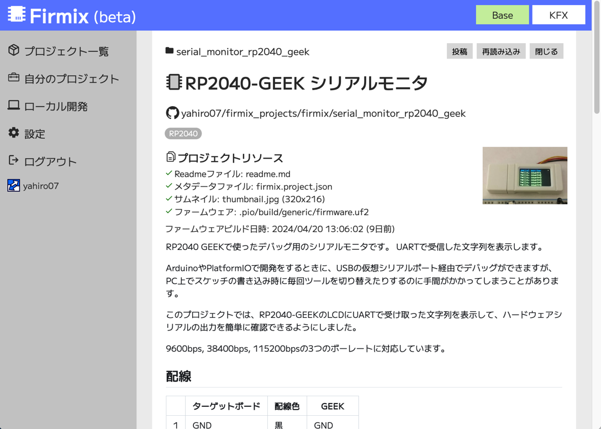
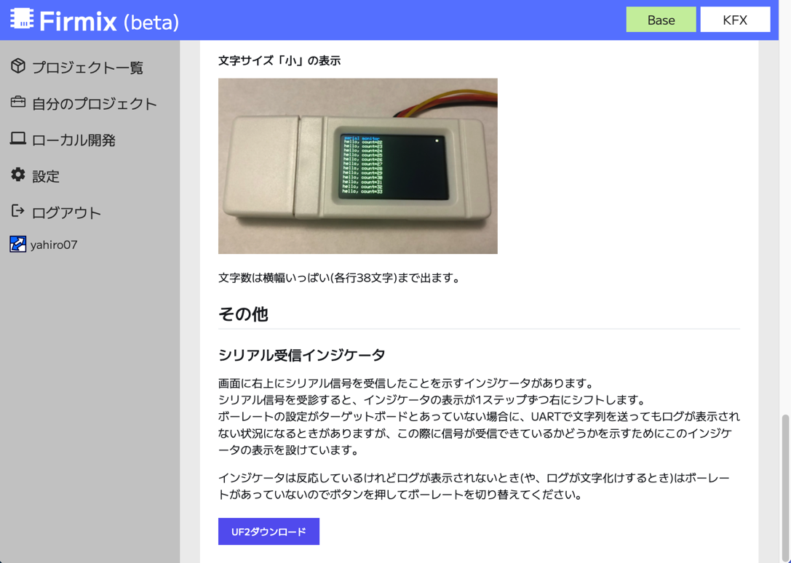
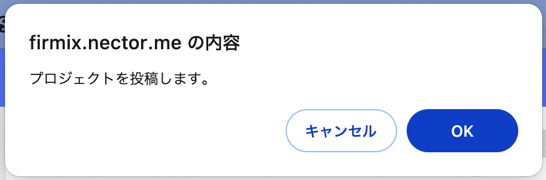
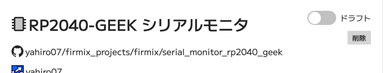
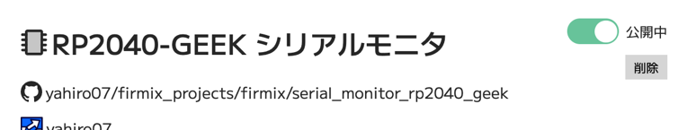

# プロジェクトの投稿

ローカル開発画面で、PCのファイルシステムからプロジェクトを読み込んで投稿することができます。  プロジェクトを投稿するにはログインが必要です。

## フォルダの読み込み

プロジェクトフォルダをドラッグ&ドロップするするか、フォルダ選択のボタンを押してプロジェクトフォルダを読み込みます。

## 表示の確認

プロジェクトリソースのセクションで、各リソースが適切に読み込めているかを表示しています。
その下にはReadmeの内容が表示されます。

ローカルファイルでコンテンツを修正した際には、「再読み込み」のボタンを押すと内容を更新できます。

ページの一番下にはUF2ファイルのダウンロードボタンがあります。ここからファームウェアをダウンロードしてボードに書き込む動作を試せます。この時点ではブラウザのローカルストレージで投稿前のファームウェアのデータを保持しており、ここで持っているファームウェアが読み込まれます。

## 投稿

「投稿」ボタンを押してプロジェクトを投稿します。未ログインの場合には投稿ボタンは表示されません。投稿する前にログインしてください。

確認ダイアログが出ます。OKを押して投稿します。

## 公開状態の変更

投稿が完了すると、自分のプロジェクトの一覧画面にプロジェクトが表示され、ここからプロジェクトの詳細画面に遷移できます。

新規プロジェクトを投稿した際には、プロジェクトの詳細画面でプロジェクトの公開状態がドラフト(下書き)になっています。

プロジェクトの投稿後、再度ファームウェアの書き込みを確認することを推奨します。プロジェクトの詳細画面でUF2ダウンロードボタンを押したときに、サーバーから取得されたファームウェアがダウンロードされます。
書き込みと動作確認ができたら、トグルスイッチのUIを操作してプロジェクトを公開状態にします。

## 投稿内容の更新

すでに投稿したプロジェクトの内容(Readme,メタデータ,ファームウェア)を更新したいときには、再度投稿すると既存の内容を更新できます。この際にメタデータで保持しているGUIDでプロジェクトが識別されており、GUIDが一致するプロジェクトがすでに存在すればそのプロジェクトを更新する動作となります。GUIDが一致するプロジェクトがあり、そのプロジェクトの所有者が自分以外のユーザーの場合にはエラーになります。

