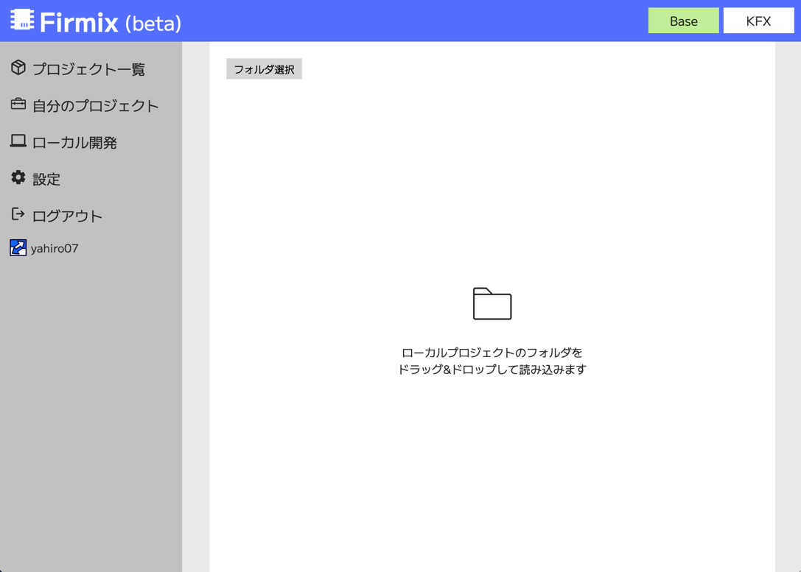
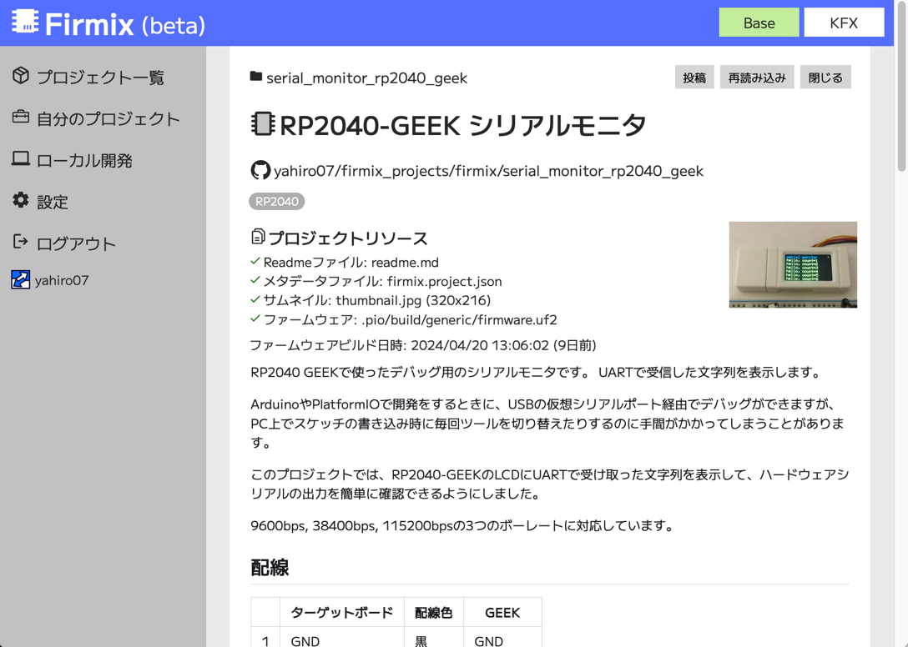

# 各画面の概要

ファームウェアを開発してプロジェクトを投稿するユーザー向けに、各画面の概要を解説します。

プロジェクトの投稿にはログインが必要です。
サイドバーのログインメニューから、Githubのアカウントでログインします。

サイトにログインすると以下のようなメニュー項目が表示されます。以下ではログイン時に追加で表示されるページの概要を紹介します。

## 自分のプロジェクト

自分が投稿したプロジェクトの一覧が表示されます。
自分が投稿したプロジェクトは、詳細画面で公開状態(ドラフト/公開中)を切り替えられてます。

プロジェクトの投稿直後はドラフトになっており、サイト全体でのプロジェクト一覧には表示されないようになっています。投稿後、ブラウザからのファームウェアの書き込みと動作確認をしてから公開状態にすることを推奨しています。

## ローカル開発

PCのローカルフォルダからプロジェクトを開いてここで表示を確認します。この画面からプロジェクトを投稿します。
投稿前に構成にエラーがないかの確認ができます。  

## 設定

API経由でプロジェクトを投稿/更新する際に利用するアクセスキーの生成/確認ができます。
