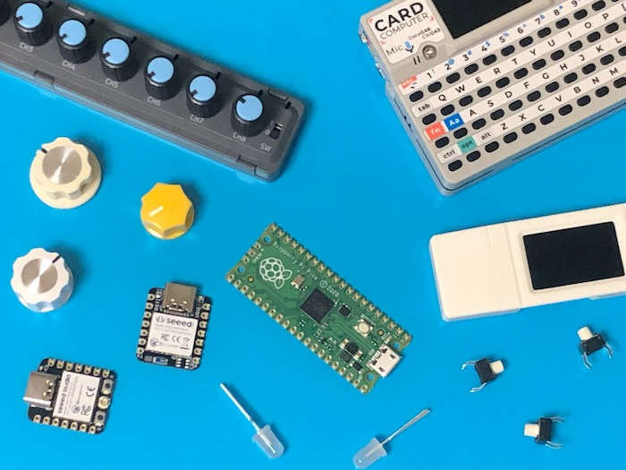

# Firmix

マイコンのファームウェアを投稿して公開するためのWebサービスです。

マイコンを使った作品の概要とファームウェアのバイナリを投稿して、電子工作の作品を誰でも簡単に再現できるようにしています。

 

電子工作界隈でよく使われているRP2040やESP32などのMCUをサポートし、これらのファームウェアをブラウザから簡単にボードに書き込める環境を提供することを目標としています。

作品の紹介とファームウェアの配布を中心に据えた電子工作のハブサイトというコンセプトで開発を進めています。

以下のURLでサイトを公開しています。

[https://firmix.nector.me](https://firmix.nector.me)

## バリエーション

### Firmix (Base)

電子工作の作品を投稿してファームウェアを公開するための、基本的な機能を実装しています。  

### Firmix KFX

Kermite(自作キーボードエコシステム)のカスタムファームウェアを配布するために作っているバージョンです。  
ファームウェアダウロード時に設定値を書き換えるバイナリパッチングの機能を追加しています。

## ドキュメント

[https://docs-firmix.nector.me](https://docs-firmix.nector.me)

仕様がある程度固まっているFirmix(Base)についてのドキュメントです。

KFXのドキュメントはまだありませんが、基本的な使い方はFirmix(Base)と同様です。

## 開発環境

[こちら](./firmix_nodejs/readme.md)に、環境構築とローカルサーバーの実行方法をまとめています。

## ライセンス

MITライセンスです。
